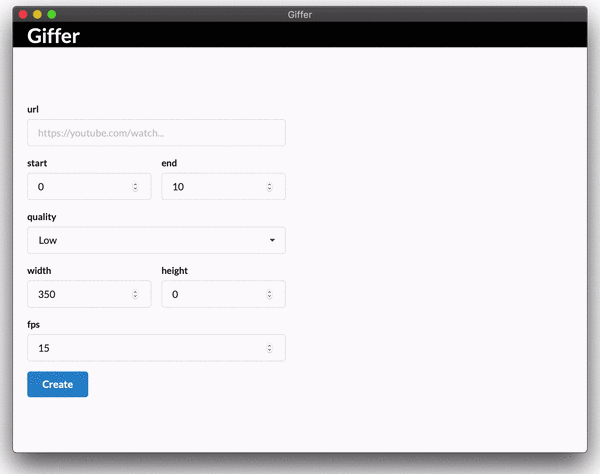
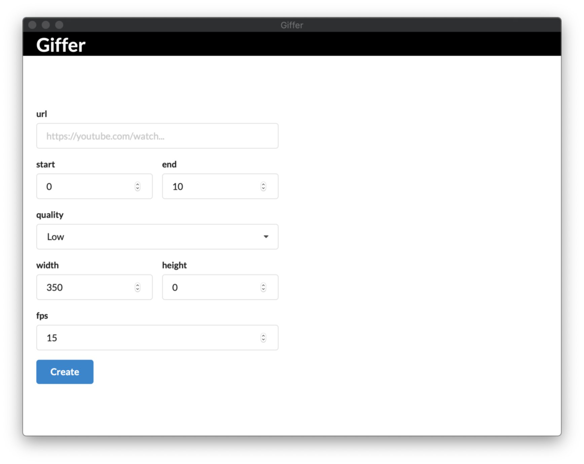
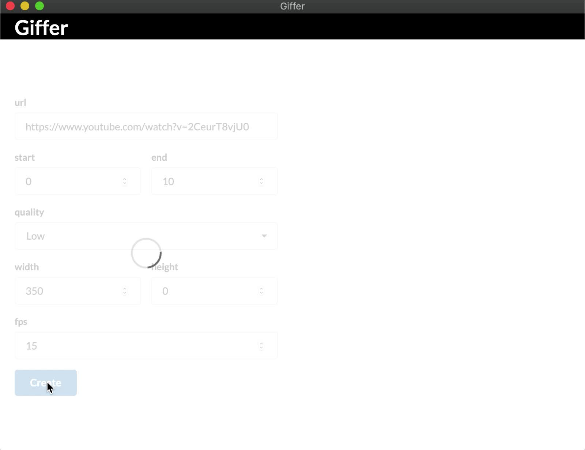
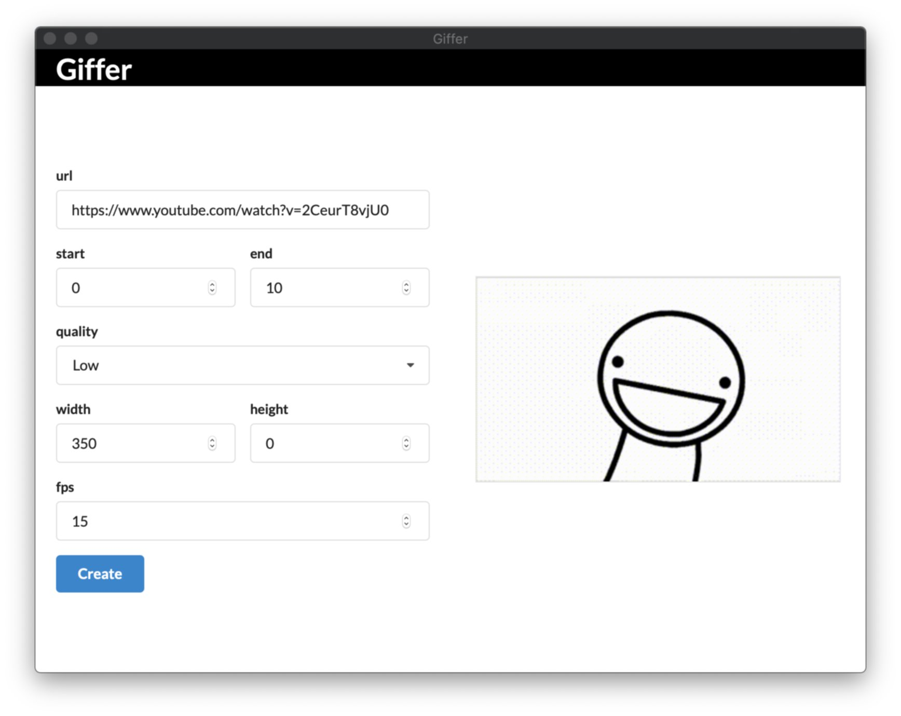

# Giffer

> Create gifs from videos!   

## Take a look  

## Tech  

- Go  
- FFmepg  
- Vuejs  
- Native webview / Chrome / localhost  

## About  

This project is about learning to bring a project to a state "completion", instead of leaving it in the half broken pre-alpha state that many projects get lost in. As such the core business logic is purposely thin, allowing more space to focus on bringing it all together into a cohesive whole.  

The current build is an MVP; that is, it functionally performs it's core objective without regard to bells, whistles and refinements - which are planned.  

## Structure 

### Core  

The root package contains the "core" domain logic. It is extremely thin by design, but not as cohesive or abstract as I'd like it to be. As the app develops, this is where the core abstractions will be. 

### Desktop  

As it stands the bulk of the code is in the `cmd/desktop` package, which is the entry point for the desktop application. This involves setting up the requisite http endpoints and starting the webview to render the UI. 

#### HTTP Interface   

HTTP is used to comminicate between the core logic and the user interface logic.  

The http endpoints include a static file server to serve the UI, endpoints to create and serve the gifs, and dynamic websocket enpoints to push notifications to the UI.  

#### User Interface  

The UI code lives inside `cmd/desktop/ui`. Since the UI is coupled to the desktop application, it made sense to place it in this sub directory. `yarn` is used to develop and compile the Vue based UI.  

#### Building  

Package `cmd/build` is the build "script" designed to produce standalone  artifacts, such as `Giffer.app` for Mac and `Giffer.exe` for Windows, ready for distribution.  

Building cross platform for desktop is a little bit more complex than a simple `go build -o Giffer`. Building involves the following core steps:  

- Compile Go files 
- Compile Vue files 
- Embed compiled Vue files in Go binary  
- Bundle a static build of FFmpeg  
- Bundle platform specific icon (`.icns` or `.ico`)  

## Features      

MVP  
- [x] Produce Gif image from URL  
        - [x] Download video files from various common sites  
        - [x] Convert video to Gif image  
        - [x] Persist produced Gif images  
        - [x] Save image to local disk (via drag)  
- Platform Bundles  
        - [x] `.app` for MacOS  
        - [ ] `.exe` for Windows  

Refinements  
- [ ] List and manipulate stored Gif images  
        - [ ] Edit name and other metadata  
        - [ ] Encode caption onto Gif  
        - [ ] Download/Save button  
        - [ ] Shareable links  
        - [ ] Drag resize  
        - [ ] Interactive clip selection  
- [ ] Support for local video files  
- [ ] Authentication (eg, OAuth)  
- [ ] Authorisation (eg, different user experience based on account attributes)  

Infrastructure  
- [ ] Hosted storage  
- [ ] Cloud hosted web ui  
- [ ] Continuous integration  