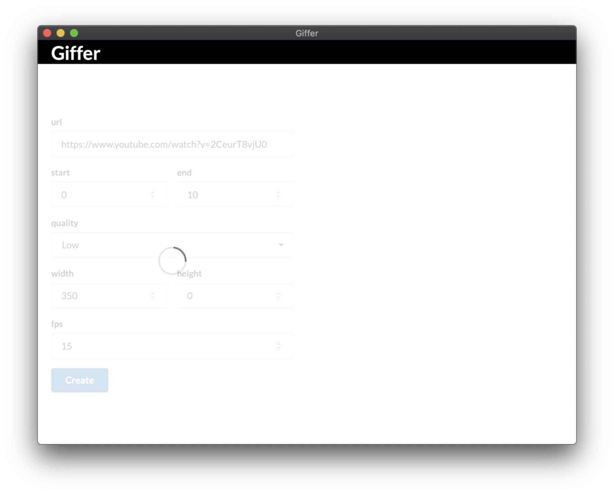

# Giffer

> Create gifs from videos!

## Take a look

## Tech

- Go (gioui.org)
- FFmepg

## About

Giffer provides a simple UI for converting slices of video to animated GIF images.

### Install

`go get github.com/jackmordaunt/giffer/cmd/gio`

## Enhancements 

- [ ] avoid downloading entire video
  - only download the portion that is needed for the GIF 
- [ ] show error toasts instead of just logging to console
